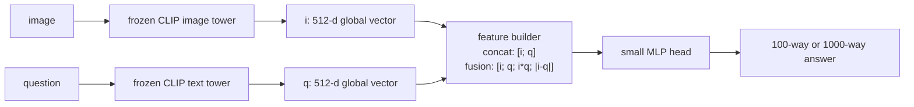
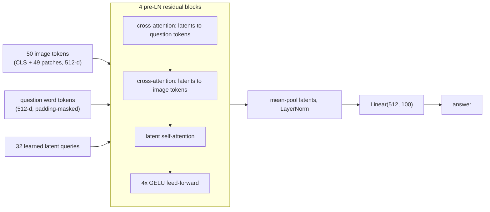
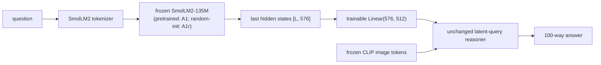
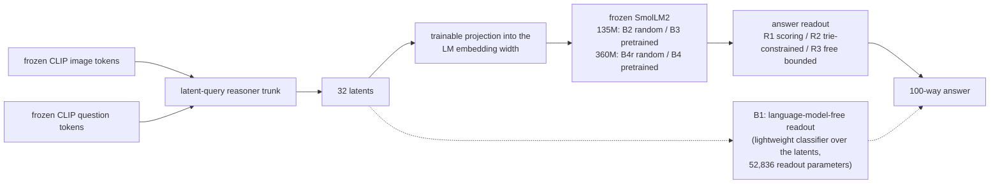

# Architecture

This document explains every model family in the project and how they relate.
Four distinct families exist. They share frozen encoders and a closed-set
answer classifier, but they are not the same architecture and results from
one must not be attributed to another:

1. global representation fusion (V1/V2, E2, E3);
2. the token-level latent-query reasoner (V3);
3. the question-side small-language-model interface (E8A);
4. the answer-side small-language-model readout (E8B, E10).

E9's compact VLMs are a fifth, external system class: frozen off-the-shelf
integrated vision-language models, evaluated but never trained, used only
for contextual positioning.

Everything trainable in this project is a lightweight head over frozen
features. No encoder and no language model is ever trained, fine-tuned,
LoRA-adapted or unfrozen anywhere.

## Shared frozen base

One frozen CLIP ViT-B-32 (open_clip, laion2b_s34b_b79k) encodes both the
image and the question, so the two global vectors share one pretrained joint
space (v2_01). For V3 and later, the same frozen encoder also provides
token-level features: 50 image tokens (CLS plus 49 patches) and per-word
question tokens, all projected into the 512-d joint space and cached to disk
(v3_00). E2 swaps in a frozen SigLIP-B/16 on the global path only. Answers
come from a closed vocabulary: top-100 (V2 canonical) or top-1000 (E3).

## Family 1 — global representation fusion

An image vector i and a question vector q (512-d each) are combined and fed
to a small MLP head that classifies over the answer vocabulary.

Variants, all sharing one head design and training procedure:

- **image-only / question-only**: one modality's vector alone (313,956
  parameters each in V1 form).
- **concat**: [i; q], 576,100 parameters at hidden width 512.
- **fusion**: [i; q; i*q; |i-q|], 1,100,388 parameters. The elementwise
  product and absolute difference are handcrafted interaction terms.
- **parameter-matched controls** (v2_03): concat_wide (hidden 979, 1,101,475
  parameters) and fusion_narrow (hidden 268, 576,032 parameters), matching
  budgets in both directions.
- **single-interaction ablations** (v2_04): product_576k and difference_576k
  ([i; q; i*q] or [i; q; |i-q|], hidden 351, 574,687 parameters), plus
  natural-width variants (838,244 parameters).
- **direct_linear** (v3_02a): Linear(1024, 100), 102,500 parameters, the
  minimal reference.
- **E2 variants**: the same heads over SigLIP-B/16 globals (768-d inputs, so
  more parameters at equal hidden width; stated, not matched).
- **E3 variants**: the same heads with a 1000-way output layer.

What this family established: either interaction term alone carries the
low-data feature gain (v2_04); the gain is roughly half capacity
(v2_03); it decays to noise at 250k while the multimodal margin grows
(v2_07); and every member shows the persistent multi-step deficit.

## Family 2 — the token-level latent-query reasoner (V3)

The central architectural contribution. Instead of two pooled vectors, the
head sees all 50 image tokens and all question word tokens, and reasons over
them with a small set of learned latent queries.

Exact size: 21,099,620 trainable parameters (8 heads, d_model 512
throughout; no input projections because the cached tokens are already in
the joint space). Training uses the cached token stores, never the raw
encoder, so the encoders remain frozen by construction.

What this family established: at 40k it matches fusion at 19 times the size
(negative result, v3_01); at 100k/250k it beats every global head in every
seed (+0.0065 / +0.0136 over fusion) as a configuration-level finding
(v3_03); its multi-step deficit is statistically indistinguishable from
fusion's at every scale; and diagnostics show the trained model leans on
the pooled CLS signal at 40k (v3_02a).

## Family 3 — the question-side SLM interface (E8A)

The reasoner trunk is kept; only the source of the question tokens changes.

- **A0p**: the interface-matched control: frozen CLIP question tokens through
  a trainable Linear(512, 512), so the only difference from A1/A1r is where
  the question tokens come from. 21,362,276 trainable parameters.
- **A1**: frozen pretrained SmolLM2-135M question states, Linear(576, 512).
  21,395,044 trainable parameters.
- **A1r**: identical architecture with deterministic random weights from a
  pinned seed; the within-size causal control for pretraining.

Required disclosure for every E8A result: in A1/A1r the image tokens come
from frozen CLIP and the question tokens from a frozen language model, so
their original representation spaces differ; the trainable projection maps
into a learned common width that is not a naturally shared pretrained
embedding space.

What this family established: pretraining helps on the question side (A1
beats A1r at both scales, growing with scale), but the whole SLM question
path loses to the interface-matched CLIP control (A1 minus A0p negative at
both scales) and roughly doubles the measured serial query cost (E7b).

## Family 4 — the answer-side SLM readout (E8B at 135M, E10 at 360M)

Here the question side stays CLIP; the frozen language model sits after the
reasoner, consuming its 32 latents and producing the answer.

- **B1**: the language-model-free readout, isolating the wider 32-latent
  interface from any language-model effect. Checkpoint selection:
  best-on-development with early stopping (its own frozen recipe).
- **B2 / B3** (135M) and **B4r / B4** (360M): random-initialised versus
  pretrained frozen readouts, architecture-matched within size. Trainable
  parameters 21,343,808 (135M) and 21,540,800 (360M); the projection width
  follows the LM hidden size, which is why the 135M-to-360M comparison is
  whole-system capacity sensitivity, not an isolated LM-size effect.
  Checkpoint selection: exactly 22 epochs, epoch 22 canonical, no early
  stopping.
- **Readout modes**: R1 (canonical scoring), R2 (greedy generation
  constrained to the vocabulary by a prefix trie), R3 (free greedy
  generation with a fixed token cap). Measured agreement within about
  0.0005, so the readout mode is immaterial to the comparisons.

Because B1's selection rule differs, B3 minus B2 (and B4 minus B4r) are the
only clean causal pretraining contrasts; any comparison against B1 is a
system-level comparison and is labelled MIXED_WITHIN_ROW in the evidence
inventory.

What this family established: no reliable positive pretrained-over-random
advantage at either LM size or training scale; training-set size dominates.

## External class — compact integrated VLMs (E9)

SmolVLM-256M-Instruct and SmolVLM-500M-Instruct: frozen end-to-end
autoregressive VLMs that consume the raw image and question and generate an
answer string. Zero trainable parameters in this project, greedy decoding
only. They differ from every family above in training history, multimodal
pretraining, answer support and output format, which is why E9 is contextual
positioning and never a matched causal comparison.

## Where the code lives

- `src/models.py` — the V1/V2 MLP heads and fusion variants.
- `src/reasoner.py` — the latent-query reasoner.
- `src/tokens_data.py`, `src/data.py` — cached-store loading.
- `experiments/e8a_question_encoder/`, `experiments/e8b_readout_generation/`,
  `experiments/e10_capacity_360m/` — the SLM interfaces and matrices.
- `experiments/e9_compact_vlm/` — the evaluation-only compact-VLM harness.
- `1_prepare_gqa.py` … `5_evaluate.py` — the legacy V1 stages.

Full per-experiment detail and every number: see
[EXPERIMENTS_AND_RESULTS.md](EXPERIMENTS_AND_RESULTS.md).
